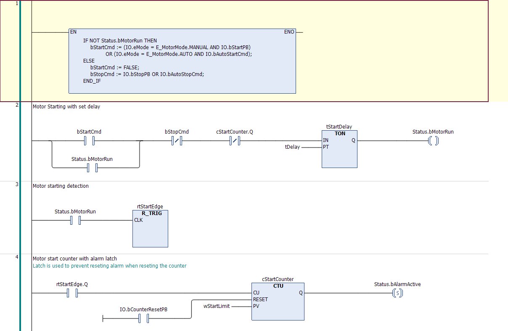
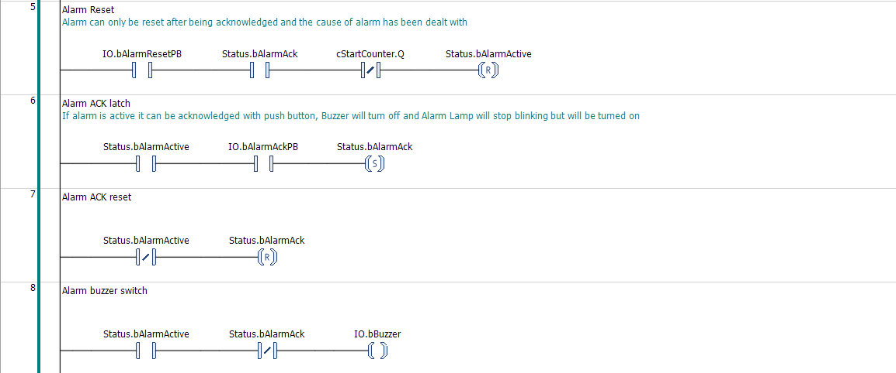
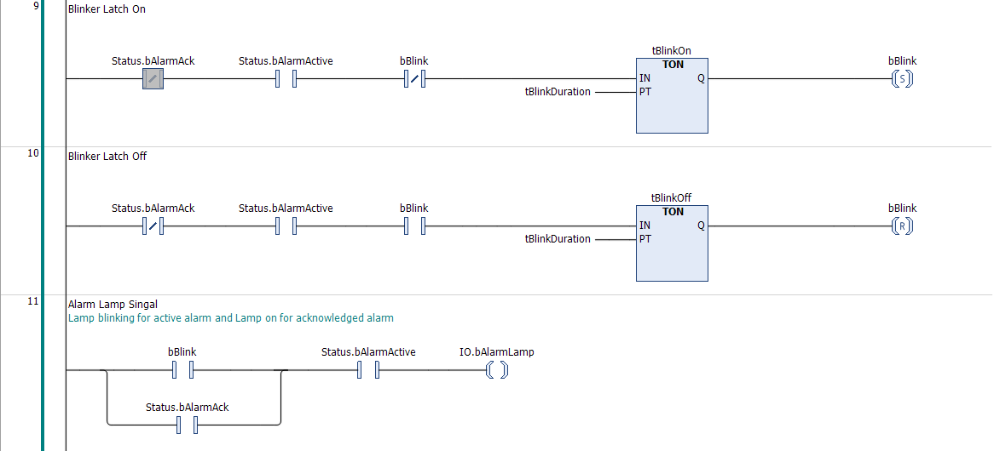
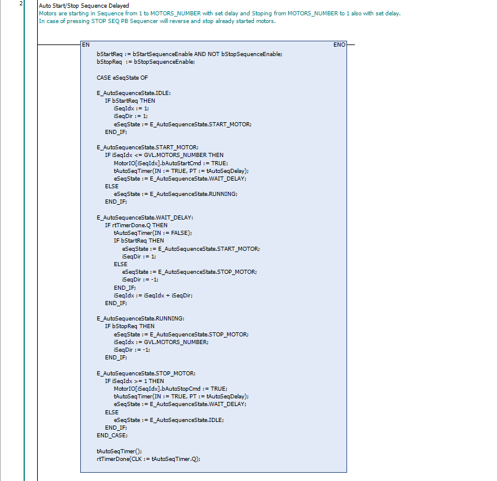
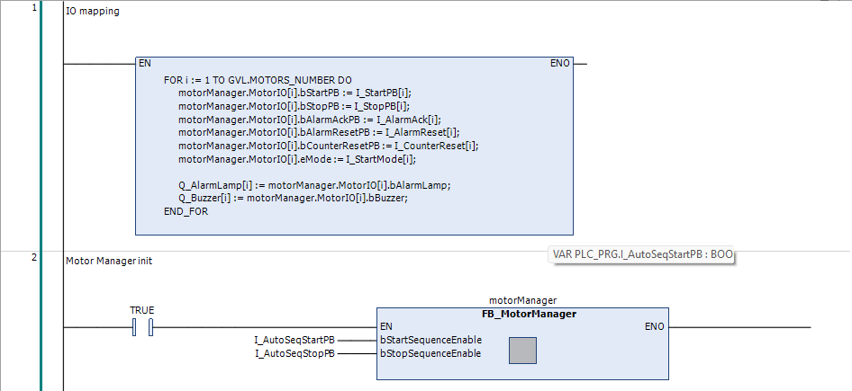

# Industrial Multi-Motor Control System

## Project Description
The project is implementing a scalable PLC control system for multiple motors using IEC61131-3 standard in CODESYS enviroment.
Reusable automation components and deterministic program execution were the main focus.
Application demonstrates industrial control concepts including modular Function Block architecture, alarm handling and automatic sequential motor start/stop.

## System Features

### Motor Controler
- Manual and Automatic modes of operation
- Start/Stop control with latching
- Start delay timer
- Start counter protection

### Alarm System
- Alarm detection and latching
- Alarm acknowledge (ACK)
- Alarm reset conditions
- Blinking alarm lamp
- Audible buzzer
- Silencing alarm lamp and buzzer with ACK

### Automatic Mode
- Sequential motor startup
- Configurable delay between motors start/stop
- State machine implementation
- Safe direction switching (start/stop sequence)

### Scalability
- Managment of multiple motors through MotorManager
- Ability to connect any number of motors
- Mapping of input controlls to motors

## Architecture

```mermaid
flowchart LR

    subgraph Application Layer
        PLC[PLC_PRG<br>Main Application]
    end

    subgraph Control Layer
        Manager[FB_MotorManager<br>Multi-Motor Controller]
    end

    subgraph Device Layer
        M1[FB_MotorControl &#91 1 &#93]
        M2[FB_MotorControl &#91 2 &#93]
        MN[FB_MotorControl &#91 N &#93]
    end

    PLC --> Manager
    Manager --> M1
    Manager --> M2
    Manager --> MN

    style PLC fill:#003366,color:#ffffff
    style Manager fill:#006633,color:#ffffff
    style M1 fill:#000000
    style M2 fill:#000000
    style MN fill:#000000
```


### Design Principles
- Modular Function Blocks
- Array-based scalability
- Seperation of IO, Logic and Status
- Deterministic scan-cycle behavior

---

## Implemented PLC Concepts
- IEC 61131-3 programming model
- Ladder Diagram (LD)
- Structured Text (ST)
- State Machine (ENUM + CASE)
- Edge Detection (R_TRIG)
- Timer lifecycle managment
- Multi-instance Function Blocks
- Hardware abstraction via structures

---


## Project Structure

```
codesys/
└── Industrial_Multi_Motor_Control_System.project

docs/
├── motor_control_ladder.png
├── motor_manager.png
└── auto_sequence_state_machine.png
```

---

## Screenshots

### Motor Control Logic


### Alarm Handling



### Automatic Sequence State Machine


### IO Mapping



---

## Purpose

This project was created as part of a PLC automation portfolio to demonstrate practical industrial programming patterns rather than academic examples.

---

## Tools

- CODESYS V3.5 SP21
- IEC 61131-3
- Ladder Diagram (LD)
- Structured Text (ST)

---

## Author

Paweł Mach

PLC / Automation Engineering Portfolio